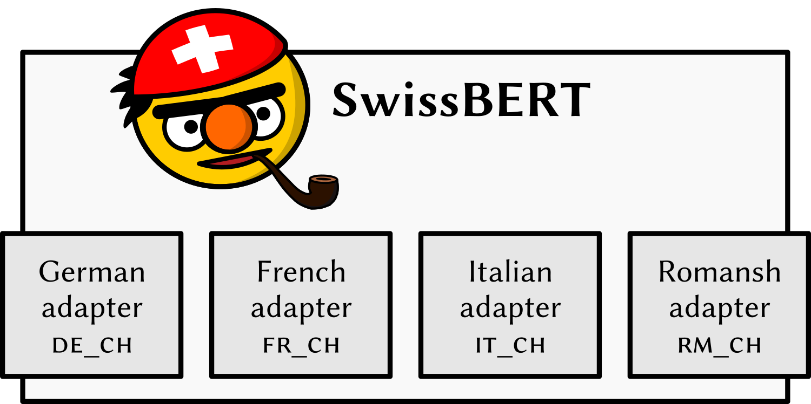

SwissBERT is a masked language model for processing Switzerland-related text. It has been trained on more than 21 million Swiss news articles retrieved from [Swissdox@LiRI](https://t.uzh.ch/1hI).

SwissBERT is based on [X-MOD](https://github.com/facebookresearch/fairseq/tree/main/examples/xmod), which has been pre-trained with language adapters in 81 languages.
We trained adapters for the national languages of Switzerland – German, French, Italian, and Romansh Grischun.
In addition, we used a Switzerland-specific subword vocabulary.

The easiest way to use SwissBERT is via the [transformers](https://github.com/huggingface/transformers) library and the Hugging Face model hub: https://huggingface.co/ZurichNLP/swissbert

## License
- This code repository: MIT license
- Model: Attribution-NonCommercial 4.0 International (CC BY-NC 4.0)

## Pre-training code
See [pretraining](pretraining)

## Evaluation code

### SwissNER
See [evaluation/swissner/notebook.ipynb](evaluation/swissner/notebook.ipynb)

### HIPE-2022
See [evaluation/hipe2022/notebook.ipynb](evaluation/hipe2022/notebook.ipynb)

### X-Stance
See [evaluation/xstance/notebook.ipynb](evaluation/xstance/notebook.ipynb)

### German–Romansh alignment
See [evaluation/romansh_alignment/notebook.ipynb](evaluation/romansh_alignment/notebook.ipynb)
